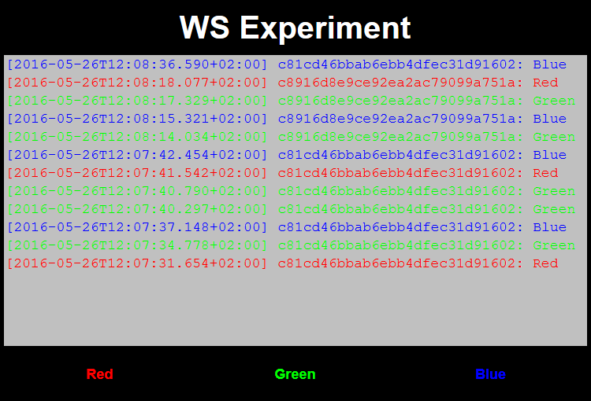
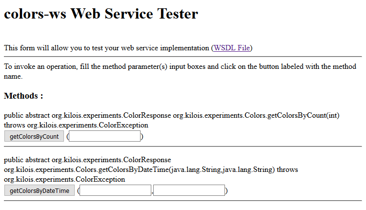
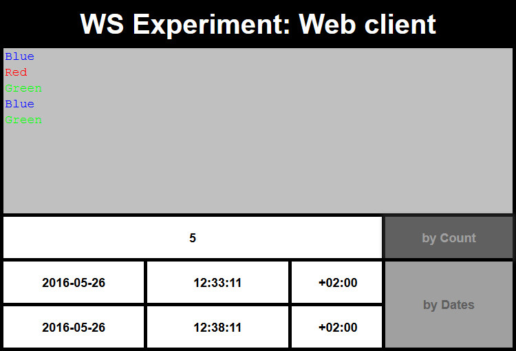
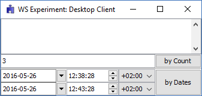

# WS Experiment
Experiment with web services

This experiment presents a simple way to develop a web service in Java EE 7 and two different approaches for creating clients.

The project uses [Maven](http://maven.apache.org) and makes use of [GlassFish Embedded Plugin](https://embedded-glassfish.java.net) for running the examples making it simple to run with no extra installations.

For the demonstrating the mechanics a simple web will be provided where you can select red, green or blue buttons and register your entries on the server. Then clients can be fed with the web service provided.

The bean implemented works as both a managed bean for the JSF page and a web service, demonstrating the convenience and simplicity of annotations. Also, extensive use of Maven plugins is made for automating the whole process. 

## Server
```
mvn clean integration-test -Prun-server
```

This will run a web in [http://localhost:8080/ws-experiment](http://localhost:8080/ws-experiment) for the user to select the colors.



At the same time the web service will be deployed in [http://localhost:8080/ws-experiment/ws-colors](http://localhost:8080/ws-experiment/ws-colors) with its corresponding [tester](http://localhost:8080/ws-experiment/ws-colors?tester) and [wsdl](http://localhost:8080/ws-experiment/ws-colors?wsdl), so clients can make use of the data recorded.



The process will follow these steps:
- Create server
- Start host
- Deploy server
- Run server

## Web client
```
mvn clean integration-test -Prun-web-client
```

This process simulates how a web application would feed from a web service running on the same host and be developed from a provided WSDL. This is a typical case of an enterprise development.

A web will be deployed in [http://localhost:8080/ws-experiment-client](http://localhost:8080/ws-experiment-client) for querying the web service in the server by getting the entries in a given count or interval.

Please, note that any time the example is run a new set of colors must be submitted.



The process will follow these steps:
- Create server
- Generate WSDL from server
- Import web service from WSDL
- Create web client
- Start host
- Deploy server
- Deploy web client
- Run web client

## Desktop client
```
mvn clean integration-test -Prun-desktop-client
```

This process simulates how an standalone desktop client would use an external running web service. This is a typical case of an utility application and similar to a phone app.

This execution will pop a desktop application that would request the already running web service.

Please, note that any time the example is run a new set of colors must be submitted.



The process will follow these steps:
- Create server
- Start host
- Deploy server
- Run server
- Import running web service
- Create desktop client
- Run desktop client
